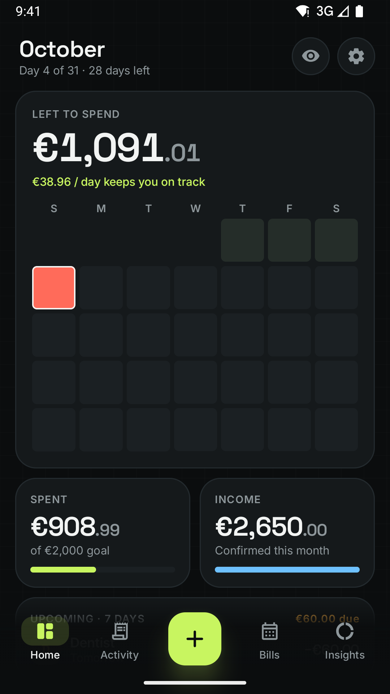
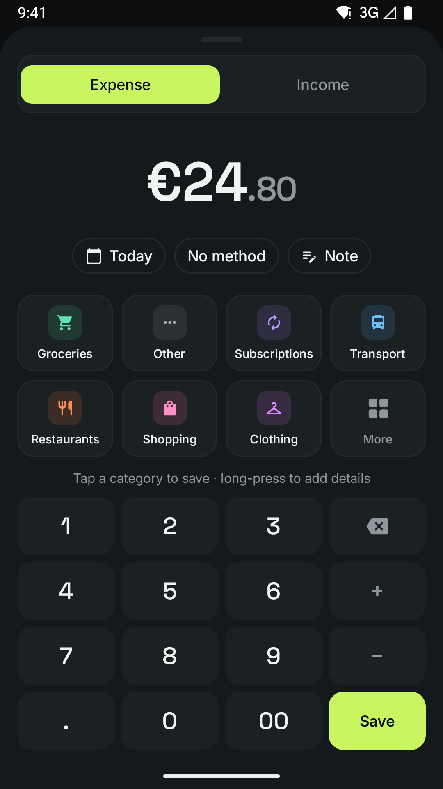
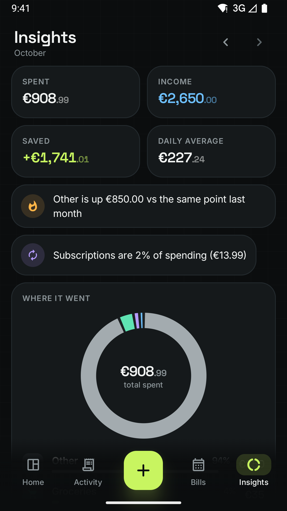
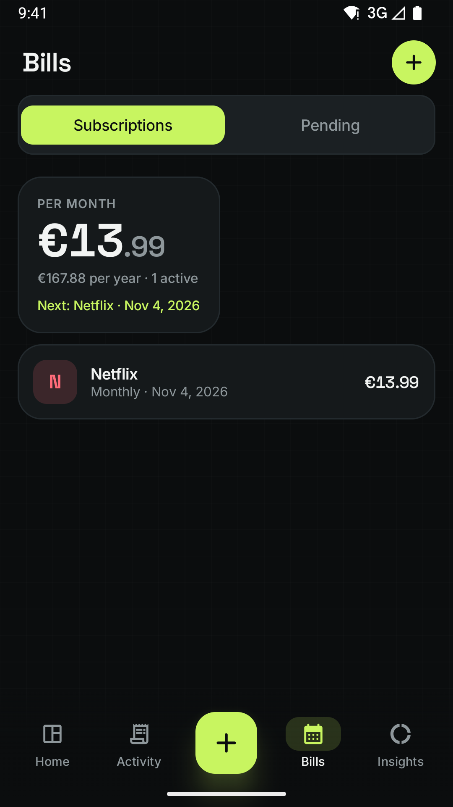
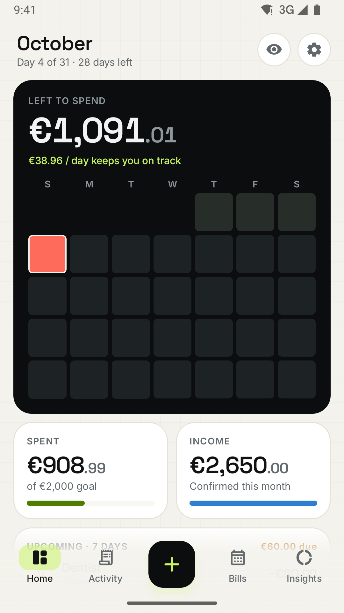

# Grid

**Every euro, on a grid.** An Android app for monthly spending, subscriptions and pending payments.

Grid shows your month as a grid of days: each cell is coloured by how that day's spending compared with your daily allowance. Logging a spend takes two taps, and payments made with Google Wallet, PayPal or Revolut can be picked up automatically.

<p>
  
  
  
  
  
</p>

## What it does

**Your month at a glance**
- *Left to spend*, the daily allowance that keeps you on track, and the **month grid** of every day of the period.
- Spent vs goal, income, the next 7 days of bills, top categories and recent activity.
- Budget periods can start on any day (1–28), for people paid on the 25th.

**Two-tap spending**
- Type an amount and tap a category, and it's saved, with Undo.
- The keypad is a calculator (`48+12.5-5`).
- Categories are ordered by how often you use them. One-tap suggestions are learned from your habits ("Coffee · €3.50").
- Open it from the + button, a launcher shortcut, the Quick Settings tile or the home-screen widget.

**Income check-in every month**
- At the start of each period, Grid asks what's coming in (prefilled from last month) and how much you want to spend.

**Bills**
- **Subscriptions** come with 24 presets (Netflix, Spotify, iCloud+…), any billing cycle and month-end-safe dates.
  - Each renewal is logged automatically, with a reminder before it hits.
  - Monthly and yearly totals are shown.
- **Pending payments**, both *to pay* and *owed to me*, have due dates, overdue highlighting and reminders.
  - Mark paid books the transaction.

**Insights**
- Where the money went (donut with drill-down), pace vs goal with an honest projection (fixed bills aren't extrapolated) and the last 6 months.
- Category budgets with 80% / 100% alerts, payment methods and top places.
- Generated insights, e.g. *"Groceries is up €250 vs the same point last month"*.

**Bank sync (Revolut, and Google Wallet and PayPal through it)**
- Imports settled Revolut transactions through Enable Banking (Open Banking, read-only), straight from your phone. Sync runs three times a day, and history can be imported for up to 12 months.
- Wallet payments with a Revolut card and PayPal purchases funded by Revolut arrive too, with the real merchant: "PAYPAL *NETFLIX" becomes Netflix, paid with PayPal.
- Payments already caught from a notification are merged, not doubled. Bills like rent are matched to their entry in Bills.
- New merchants and transfers are grouped for one-tap review, and every choice is learned. Moves between your own pockets and vaults are ignored.
- **Savings:** money moved in from your salary account is tracked as *Moved to Revolut*, not income. Home shows salary − moved = saved. Any transfer can be counted in the next month, for example a salary moved on the 29th.
- Setup takes 10 minutes and is free for personal use: [docs/BANK_SYNC_SETUP.md](docs/BANK_SYNC_SETUP.md).

**Payment detection (Google Wallet, PayPal, Revolut)**
- Reads those three apps' payment notifications, on your phone only, the moment you pay.
- New merchants arrive with one-tap category buttons. Merchants you've categorised before are added automatically, with Undo.
- Unrecognised formats are kept locally so the parsers can be improved.

**Backup like WhatsApp**
- Google Drive backup to the hidden app folder: automatic daily, weekly or monthly, Wi-Fi only if you like, and restore on any phone.
- Also: backup files you save anywhere, and CSV export.

**Everything else**
- Light / dark / system theme, plus optional Material You colours.
- App lock (fingerprint, face or PIN), a hide-amounts mode, and custom categories with icons, colours and budgets.

## Privacy
There's no account, no server and no analytics. Data lives in a local database on your phone. The only network traffic is to *your* Google Drive (if you turn backup on) and to Enable Banking (if you turn bank sync on, using your own key, which stays encrypted on the phone). Android's automatic cloud backup is disabled for Grid: backups are explicit and under your control.

## Install on your phone
1. Enable *Developer options → USB debugging* on the phone and plug it in.
2. Run `.\scripts\build.ps1`, then `adb install -r app\build\outputs\apk\debug\app-debug.apk`.

Installing through `adb` (or Play) avoids Android's "restricted settings" block on notification access. If you sideload the APK another way, the in-app setup explains how to allow it.

**Google Drive backup** needs a one-time, 10-minute Google Cloud setup: [docs/GOOGLE_DRIVE_SETUP.md](docs/GOOGLE_DRIVE_SETUP.md).

## Development

| | |
|---|---|
| Language / UI | Kotlin 2.4, Jetpack Compose (BOM 2026.09), Material 3 |
| Architecture | Single module; Compose → Hilt ViewModels → repositories → Room / DataStore. Pure-Kotlin domain code (money, periods, billing, insights, parsers) with no Android imports |
| Build | Gradle 9.8, AGP 9.4, compileSdk 37, targetSdk 36, minSdk 26 |
| Background | WorkManager (daily bills/reminders, Drive backup, bank sync), NotificationListenerService (payment detection), Glance (widget) |

Requires Android Studio's bundled JDK 21 and the Android SDK. The scripts handle the rest:

```powershell
.\scripts\build.ps1            # debug APK
.\scripts\run.ps1 -Fresh       # build, boot the emulator, install, launch
.\scripts\unit.ps1             # ~180 JVM unit tests (Robolectric for Room/Android pieces)
.\scripts\e2e.ps1              # fresh install + every on-device end-to-end flow
.\scripts\logs.ps1             # app logcat
.\scripts\screenshot.ps1 name  # device screenshot → screenshots/
.\scripts\sha1.ps1             # signing fingerprint for the Drive OAuth client
```

CI (GitHub Actions) builds, runs the unit tests and lint on every push.

## Docs
- [Design spec](docs/superpowers/specs/2026-10-04-grid-v2-design.md): product scope, design system and architecture
- [Implementation plans](docs/superpowers/plans/), one per milestone
- [Google Drive setup](docs/GOOGLE_DRIVE_SETUP.md)
- [Bank sync setup](docs/BANK_SYNC_SETUP.md) (Revolut via Enable Banking)
- [Working with Jules](docs/JULES.md), the AI agent that wrote the first draft, and how to talk to it

Grid v2 replaces the first draft (preserved as the `jules-draft` tag).
